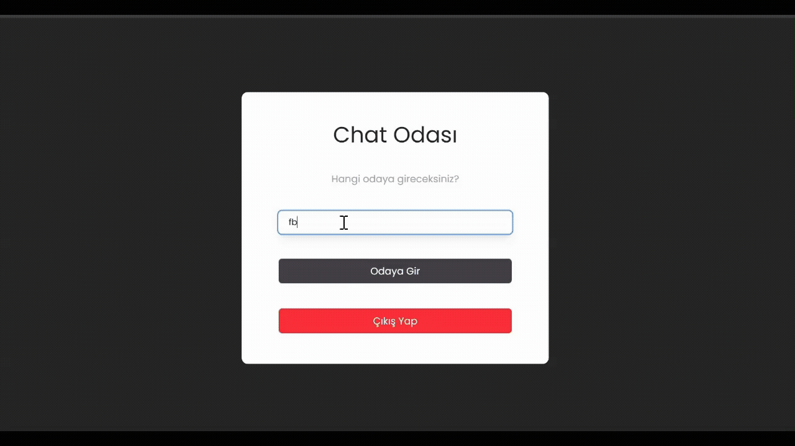

# 💬 ChatApp - Real-Time Messaging

Bu proje, **React** ve **Firebase** kullanılarak geliştirilmiş, modern ve dinamik bir anlık mesajlaşma uygulamasıdır. Kullanıcıların oda bazlı sohbet etmelerine olanak tanır.

## 🚀 Özellikler
- **Google Auth:** Firebase ile güvenli giriş sistemi.
- **Anlık Veri:** Mesajların eşzamanlı olarak tüm cihazlarda güncellenmesi.
- **Modern Arayüz:** Tailwind CSS ile responsive (mobil uyumlu) tasarım.
- **Oda Sistemi:** Kullanıcıların istedikleri odaya girip mesajlaşabilmesi.

## 🛠️ Kullanılan Teknolojiler
- **Frontend:** React, Tailwind CSS
- **Backend/Database:** Firebase Firestore, Firebase Auth
- **Geliştirme Araçları:** Vite, VS Code Dev Tunnels / Ngrok

## 📦 Kurulum

1. Depoyu klonlayın:
   ```bash
   git clone https://github.com/HasanEROL1/chat-app

   2.Firebaseda ayarlarınızı yapın

   3.Firestorea verileri kaydedin


   

  ## 
